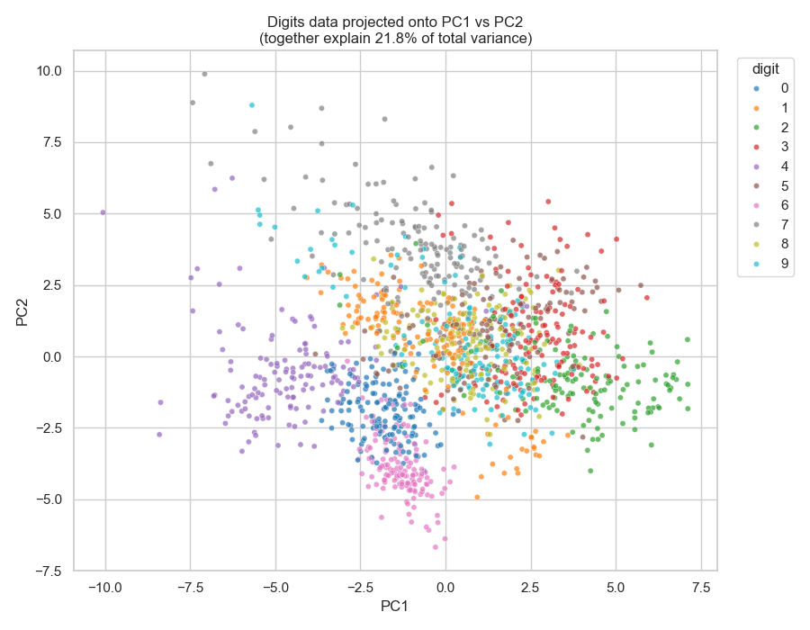
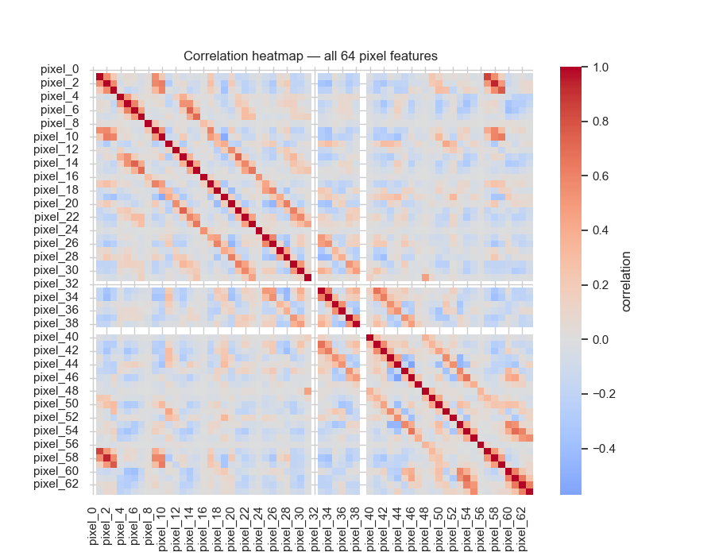
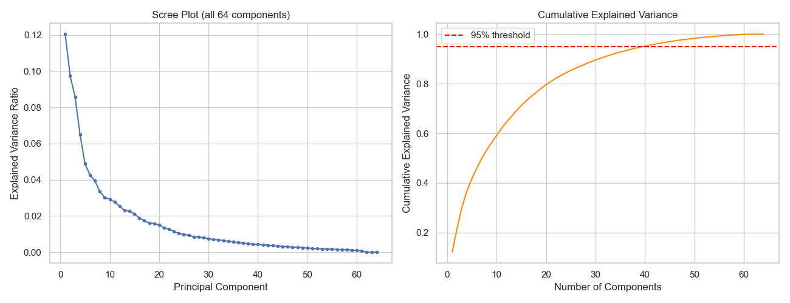

# PCA — Handwritten Digit Recognition

> Dimensionality reduction with Principal Component Analysis on the sklearn Digits dataset — compressing 64 pixel features down to 40 components while retaining 95% of the total variance, and evaluating the effect on classification accuracy through Logistic Regression and image reconstruction.

## Table of Contents

- [Overview](#overview)
- [Dataset](#dataset)
- [Approach](#approach)
- [Results](#results)
- [Visuals](#visuals)
- [Repo Structure](#repo-structure)
- [Setup](#setup)
- [Tech Stack](#tech-stack)

## Overview

Each handwritten digit image is a flattened 8×8 grid of pixel intensities, resulting in 64 features. Many of these features contain redundant information because neighboring pixels tend to have similar values.

This project uses Principal Component Analysis (PCA) to reduce the dimensionality of the dataset while retaining most of its variance. The project compares a Logistic Regression baseline using all 64 features with a PCA-reduced model using 40 components.

The project also uses PCA-based visualizations and image reconstruction to demonstrate how information is retained or lost as the number of principal components changes.

## Dataset

**sklearn Digits dataset** (`sklearn.datasets.load_digits`)

| Property | Value |
|---|---|
| Samples | 1,797 |
| Classes | 10 (digits 0–9) |
| Features | 64 (8×8 grayscale pixels, intensity 0–16) |
| Missing values | None |
| Train / Test split | 1,437 / 360 (80/20, stratified) |

No external download is required — the dataset ships with scikit-learn.

## Approach

The notebook is organized into 5 modules:

1. **Setup & Data Understanding (EDA)**  
   Load the dataset, inspect the class distribution, visualize sample digits, and analyze pixel correlations.

2. **Baseline Model — No PCA**  
   Standardize all 64 features and train a multinomial Logistic Regression model. Accuracy and training time are recorded as the baseline.

3. **Applying PCA**  
   Fit PCA on the standardized training data using `PCA(n_components=0.95)`. Scikit-learn automatically selects the minimum number of components required to retain 95% of the total variance. The scree plot and cumulative explained variance are also inspected.

4. **Model on PCA-Reduced Data + Visualization**  
   Retrain the same Logistic Regression classifier on the PCA-reduced features, compare it with the baseline, visualize the data using a 2D PC1-vs-PC2 projection, and reconstruct sample digits using different numbers of components.

5. **Insights**  
   Compare accuracy, training time, dimensionality, and the information retained after PCA.

## Results

| Metric | Baseline (64 features) | PCA-reduced (40 components) |
|---|---:|---:|
| Accuracy | 97.2% | 95.3% |
| Training time | 0.024 sec | 0.019 sec |
| Dimensionality | 64 | 40 |
| Dimensionality reduction | — | 37.5% |

PCA reduced the feature space from **64 to 40 components**, corresponding to a **37.5% reduction in dimensionality**, while retaining **95% of the total variance**.

The PCA-reduced Logistic Regression model achieved **95.3% accuracy**, compared with **97.2%** for the baseline model. Training time also decreased from **0.024 seconds to 0.019 seconds**.

This demonstrates the trade-off between dimensionality reduction, computational efficiency, and classification accuracy.

## Visuals

### 2D PCA Projection

A separate 2-component PCA is used only for visualization. It projects the 64-dimensional digit data onto PC1 and PC2 so that the digit classes can be viewed in a 2D scatter plot.



### Pixel Correlation Heatmap

The correlation heatmap shows relationships between the pixel features. Strong correlations between neighboring pixels demonstrate why dimensionality reduction can be useful.



### Scree Plot and Cumulative Explained Variance

The scree plot and cumulative explained variance show how much variance is captured as more principal components are added. This analysis provides the basis for selecting the number of components required to retain 95% of the total variance.


### Threshold Analysis

This visualization supports the analysis of the variance-retention threshold used when selecting the PCA components.



## Repo Structure

```text
PCA-Digits-Dimensionality-Reduction/
│
├── images/
│   ├── 2D_PCA_scatter.png
│   ├── Pixel_correlation_heatmap.png
│   ├── Scree plot_and_cumulative_explained_variance.png
│   └── threshold.png
│
├── notebooks/
│   └── pca_digits_recognition.ipynb
│
├── .gitignore
├── README.md
└── requirements.txt